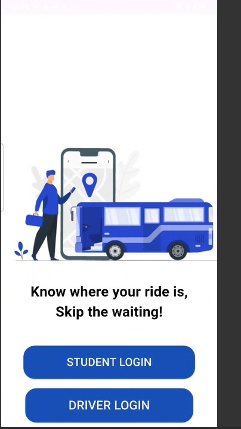
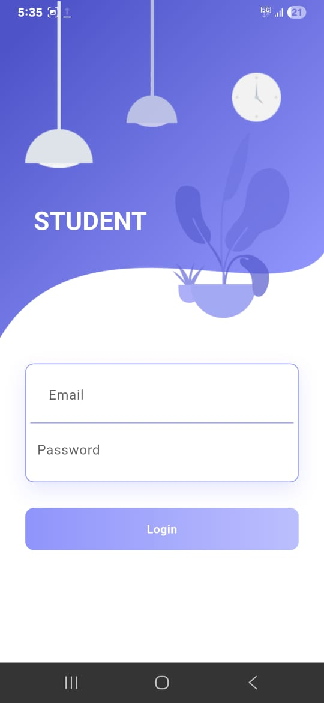
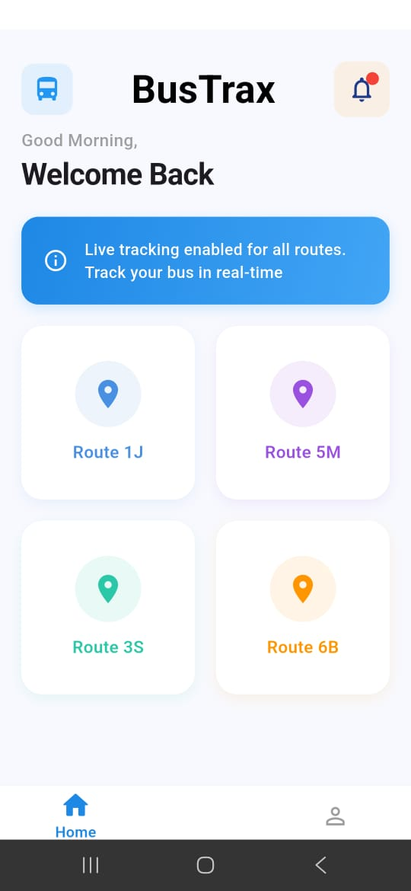
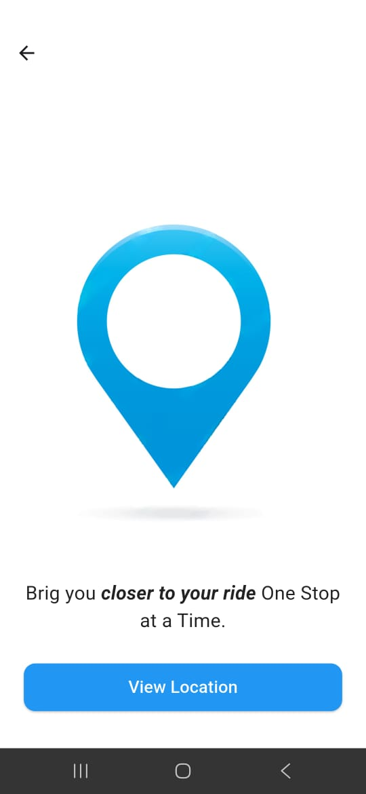
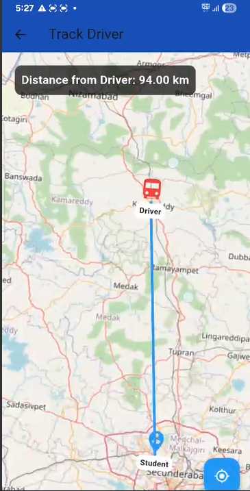
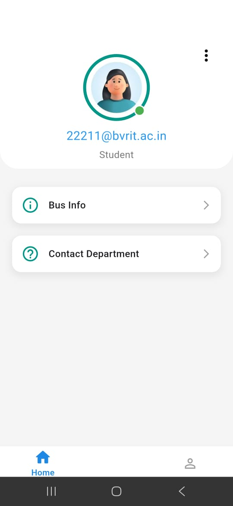

#  Bustrax – Real-Time Bus Tracking System  

**Bustrax** is a real-time bus tracking application developed using **Flutter** and **Firebase Realtime Database**.  
The app allows students, staff, and administrators to track buses live on a map, improving convenience, safety, and punctuality.  

## 📸 App Screenshots  

<p align="center">
  
  
</p>

<p align="center">
  
  
  
</p>

<p align="center">
  
  
</p>
  

---

##  Features  

- **Real-Time Tracking:** Displays the live location of buses using **OpenStreetMap API**.  
- **User Roles:**  
  - **Driver:** Can update live locatiion of bus.  
  - **Student/Staff:** Can view live bus locations.  
- **Secure Authentication:** Login system powered by **Firebase Authentication**.  
- **Optimized Performance:** Data synced via **Firebase Realtime Database** for minimal latency.  

---

##  Getting Started  

Follow these steps to set up and run Bustrax locally:  

### 1. Clone the repository  
```bash
git clone https://github.com/akshaya-527/Bustrax.git
cd Bustrax
